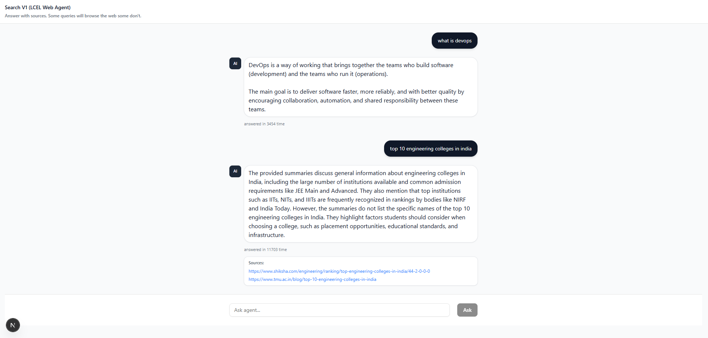
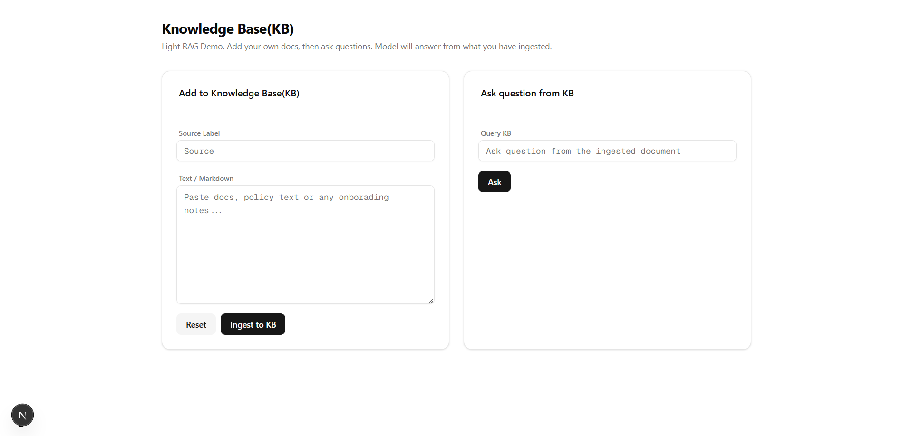
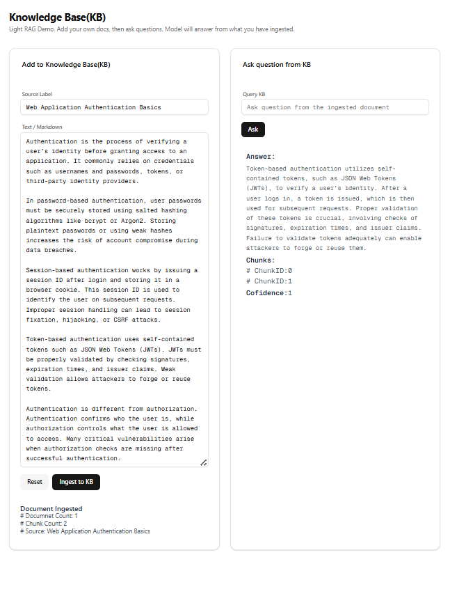

# 🔍 Tool Calling Light RAG

A full-stack **Retrieval Augmented Generation (RAG)** application with intelligent routing that combines web search capabilities with a local knowledge base. Built with LangChain Expression Language (LCEL), this project demonstrates advanced tool calling patterns for AI-powered question answering.





## ✨ Features

- **🤖 Intelligent Query Routing**: Automatically determines whether to use web search or query the local knowledge base based on query patterns
- **🌐 Web Search Integration**: Searches the web for recent information, rankings, comparisons, and current events using Tavily API
- **📚 Light RAG System**: In-memory vector store for fast document retrieval with embedding-based similarity search
- **🔗 Multi-LLM Support**: Compatible with OpenAI, Google Gemini, and Groq models
- **💬 Interactive Chat Interface**: Modern Next.js UI for seamless user interactions
- **📊 Source Attribution**: Provides sources and confidence scores for all answers
- **🎯 Pattern-Based Routing**: Smart detection of queries requiring web search vs. direct knowledge base access

## 🏗️ Architecture

The application follows a **monorepo structure** with separate client and server:

```
├── client/          # Next.js frontend application
└── server/          # Express.js backend with LangChain integration
```

### System Flow

1. **Query Reception**: User submits a query through the web interface
2. **Routing Decision**: System analyzes the query using pattern matching to determine:
   - **Web Path**: For queries requiring current/recent information
   - **Direct Path**: For general knowledge queries
3. **Execution**:
   - **Web Path**: Web search → URL extraction → Content summarization → LLM synthesis
   - **Direct Path**: Direct LLM response or Knowledge Base query
4. **Response**: Returns answer with sources and metadata

## 🛠️ Tech Stack

### Frontend

- **Next.js 16** - React framework with App Router
- **React 19** - UI library
- **TypeScript** - Type safety
- **Tailwind CSS** - Styling
- **Radix UI** - Accessible component primitives
- **Axios** - HTTP client

### Backend

- **Express.js** - Web server framework
- **TypeScript** - Type safety
- **LangChain** - LLM orchestration framework
- **LangChain Expression Language (LCEL)** - Chain composition
- **MemoryVectorStore** - In-memory vector database
- **Zod** - Schema validation

### AI/ML

- **OpenAI** - GPT models and embeddings
- **Google Gemini** - Gemini models and embeddings
- **Groq** - Fast inference models
- **Tavily** - Web search API

## 📋 Prerequisites

Before you begin, ensure you have:

- **Node.js** (v18 or higher)
- **npm** or **yarn** package manager
- API keys for at least one of the following:
  - OpenAI API key (for OpenAI models)
  - Google API key (for Gemini models)
  - Groq API key (for Groq models)
  - Tavily API key (for web search)

## 🚀 Installation

1. **Clone the repository**

   ```bash
   git clone https://github.com/thrivingSec/4_Tool_Calling_Light_RAG.git
   cd 4_Tool_Calling_Light_RAG
   ```

2. **Install server dependencies**

   ```bash
   cd server
   npm install
   ```

3. **Install client dependencies**
   ```bash
   cd ../client
   npm install
   ```

## ⚙️ Configuration

### Server Configuration

Create a `.env` file in the `server/` directory:

```env
# Server Configuration
PORT=5000
ALLOWED_ORIGIN=http://localhost:3000

# LLM Provider (choose one: 'openai', 'gemini', or 'groq')
PROVIDER=gemini

# OpenAI Configuration (if using OpenAI)
OPENAI_API_KEY=your_openai_api_key_here
OPENAI_MODEL=gpt-4o-mini

# Google Gemini Configuration (if using Gemini)
GOOGLE_API_KEY=your_google_api_key_here
GOOGLE_MODEL=gemini-2.5-flash

# Groq Configuration (if using Groq)
GROQ_API_KEY=your_groq_api_key_here
GROQ_MODEL=llama-3.1-8b-instant

# RAG Embedding Provider (for knowledge base)
RAG_MODEL_PROVIDER=gemini  # or 'openai'

# Web Search Configuration
SEARCH_PROVIDER=tavily
TAVILY_API_KEY=your_tavily_api_key_here
```

### Client Configuration

Create a `.env.local` file in the `client/` directory (optional):

```env
NEXT_PUBLIC_SERVER_URL=http://localhost:5000
```

Or update `client/src/lib/config.ts` with your server URL.

## 🎮 Usage

### Starting the Development Servers

1. **Start the backend server** (from `server/` directory):

   ```bash
   npm run dev:server
   ```

   Server will run on `http://localhost:5000`

2. **Start the frontend** (from `client/` directory):
   ```bash
   npm run dev
   ```
   Client will run on `http://localhost:3000`

### Using the Application

#### Main Search Interface (`/`)

- Enter your query in the search box
- The system automatically routes to web search or direct response
- View answers with source links and response time

**Example Queries:**

- `"top 10 engineering colleges in india in 2025"` → Triggers web search
- `"what is devops"` → Direct LLM response
- `"best laptops under $1000"` → Triggers web search
- `"explain machine learning"` → Direct LLM response

#### Knowledge Base Interface (`/kb`)

1. **Ingest Documents**:

   - Add a source label (e.g., "Company Policy")
   - Paste text or markdown content
   - Click "Ingest to KB" to add to the knowledge base

2. **Query Knowledge Base**:

   - Enter questions about your ingested documents
   - Get answers with chunk references and confidence scores

3. **Reset Knowledge Base**:
   - Click "Reset" to clear all ingested documents

## 📡 API Endpoints

### Search Endpoint

```http
POST /api/user/search
Content-Type: application/json

{
  "q": "your search query"
}
```

**Response:**

```json
{
  "answer": "Generated answer...",
  "sources": ["https://source1.com", "https://source2.com"],
  "mode": "web" | "direct"
}
```

### Ingest Endpoint

```http
POST /api/user/ingest
Content-Type: application/json

{
  "text": "Document content to ingest...",
  "source": "Document source label"
}
```

**Response:**

```json
{
  "ok": true,
  "docsCount": 1,
  "chunksCount": 5,
  "source": "Document source label"
}
```

### Query Knowledge Base

```http
POST /api/user/query
Content-Type: application/json

{
  "query": "Question about ingested documents",
  "k": 2
}
```

**Response:**

```json
{
  "answer": "Answer from knowledge base...",
  "sources": [
    { "source": "doc.txt", "chunkId": 0 },
    { "source": "doc.txt", "chunkId": 1 }
  ],
  "confidence": 0.85
}
```

### Reset Knowledge Base

```http
GET /api/user/reset
```

**Response:**

```json
{
  "ok": true
}
```

## 📁 Project Structure

```
4_Tool_Calling_Light_RAG/
├── client/                          # Next.js frontend
│   ├── src/
│   │   ├── app/                     # Next.js app router
│   │   │   ├── page.tsx            # Main search interface
│   │   │   └── kb/                 # Knowledge base interface
│   │   ├── components/             # React components
│   │   │   └── ui/                 # UI primitives
│   │   └── lib/                    # Utilities and config
│   └── package.json
│
└── server/                          # Express.js backend
    ├── src/
    │   ├── controllers/             # Request handlers
    │   │   ├── search.controller.ts
    │   │   └── rag.controller.ts
    │   ├── light_rag/              # RAG implementation
    │   │   ├── ask.ts              # Query knowledge base
    │   │   ├── chunk.ts            # Text chunking
    │   │   ├── ingest.ts           # Document ingestion
    │   │   └── store.ts            # Vector store management
    │   ├── search_tool/             # Search chain components
    │   │   ├── searchChain.ts      # Main search chain
    │   │   ├── routeStrategy.ts    # Query routing logic
    │   │   ├── webPipeline.ts      # Web search pipeline
    │   │   ├── directPipeline.ts   # Direct response pipeline
    │   │   └── finalValidate.ts    # Response validation
    │   ├── routes/                 # API routes
    │   ├── shared/                 # Shared utilities
    │   │   ├── model.ts            # LLM model factory
    │   │   └── env.ts              # Environment config
    │   └── utils/                  # Helper functions
    │       ├── webSearch.ts        # Web search utility
    │       ├── summarize.ts        # Content summarization
    │       └── schemas.ts          # Zod schemas
    └── package.json
```

## 🔄 How It Works

### Routing Strategy

The system uses pattern-based routing to determine query handling:

**Web Search Triggers:**

- Queries longer than 75 characters
- Recent year mentions (2024-2039)
- Ranking queries ("top 10", "best")
- Comparison queries ("vs", "compare")
- Price queries ("under $X", "cheapest")
- Current events ("latest", "news", "today")
- Location queries ("near me")

**Direct Path:**

- General knowledge questions
- Conceptual explanations
- Simple queries without specific patterns

### RAG Pipeline

1. **Document Ingestion**:

   - Text is chunked into smaller pieces
   - Chunks are embedded using selected embedding model
   - Embeddings stored in in-memory vector store

2. **Query Processing**:

   - Query is embedded using the same model
   - Similarity search finds relevant chunks
   - Top-k chunks retrieved with similarity scores

3. **Answer Generation**:
   - Context built from retrieved chunks
   - LLM generates answer grounded in context
   - Confidence score calculated from similarity scores

### Web Search Pipeline

1. **Search**: Query sent to Tavily API
2. **URL Extraction**: Top results selected
3. **Content Retrieval**: Pages fetched and parsed
4. **Summarization**: Content summarized for context
5. **Synthesis**: LLM generates answer from summaries

## 🧪 Development

### Building for Production

**Client:**

```bash
cd client
npm run build
npm start
```

**Server:**
The server uses `tsx` for development. For production, you may want to:

- Compile TypeScript to JavaScript
- Use a process manager like PM2
- Set up proper environment variables

## 🤝 Contributing

Contributions are welcome! Please feel free to submit a Pull Request. For major changes, please open an issue first to discuss what you would like to change.

## 📝 License

This project is open source and available under the [MIT License](LICENSE).

## 🙏 Acknowledgments

- [LangChain](https://www.langchain.com/) for the excellent LLM orchestration framework
- [Next.js](https://nextjs.org/) for the React framework
- [Radix UI](https://www.radix-ui.com/) for accessible components

## 📧 Support

For questions, issues, or feature requests, please open an issue on GitHub.

---

**Built with ❤️ using LangChain, Next.js, and TypeScript**
